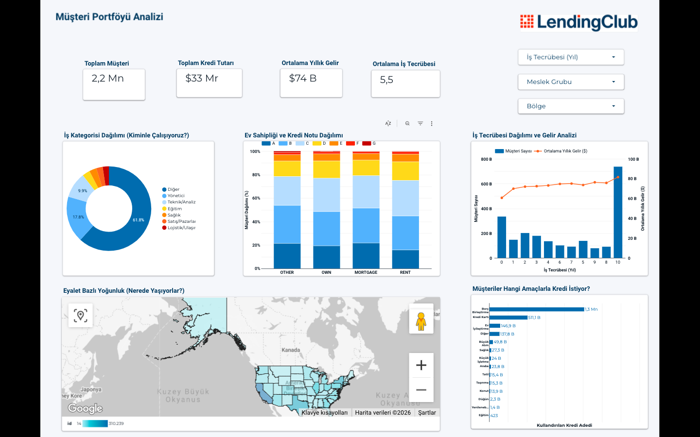
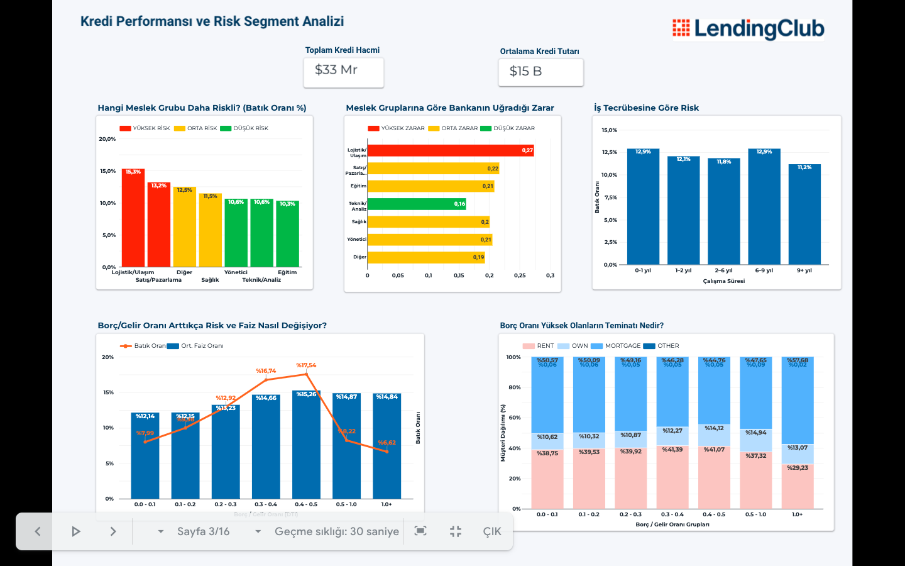
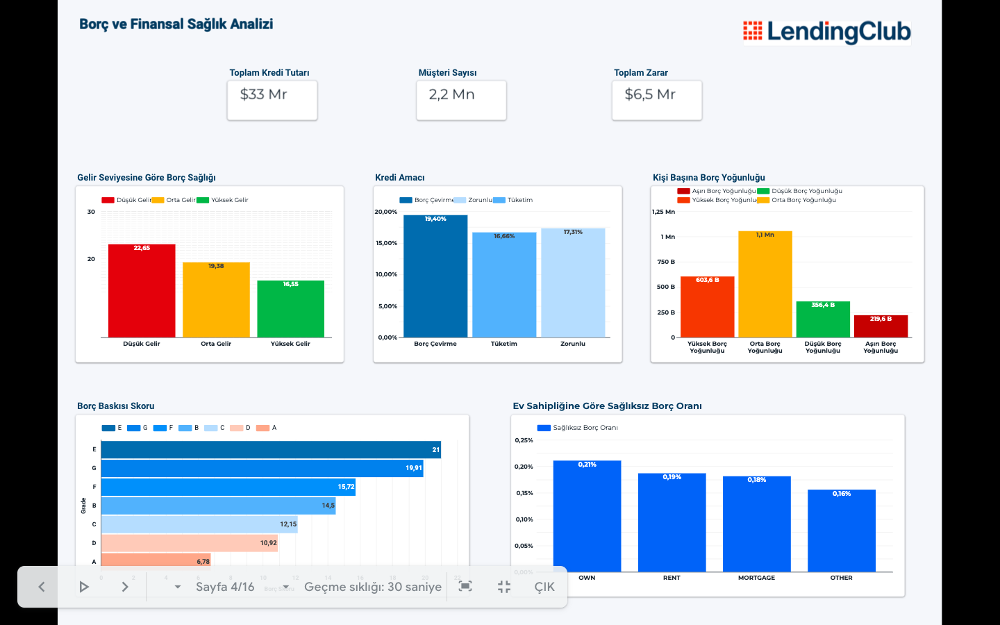
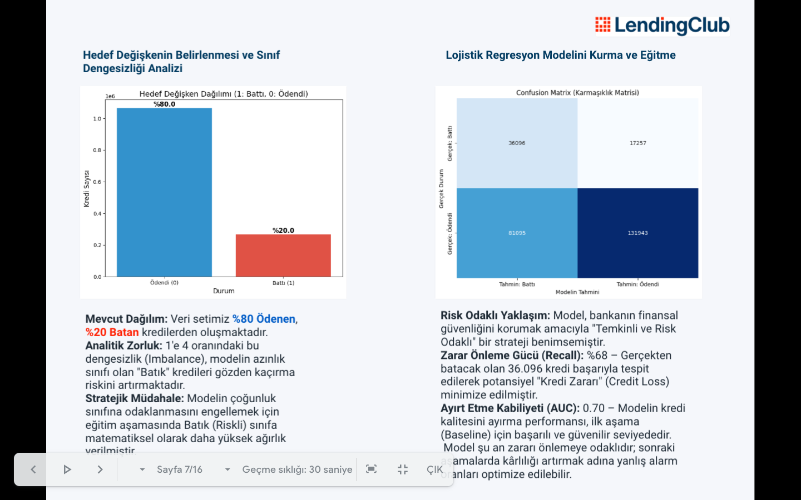
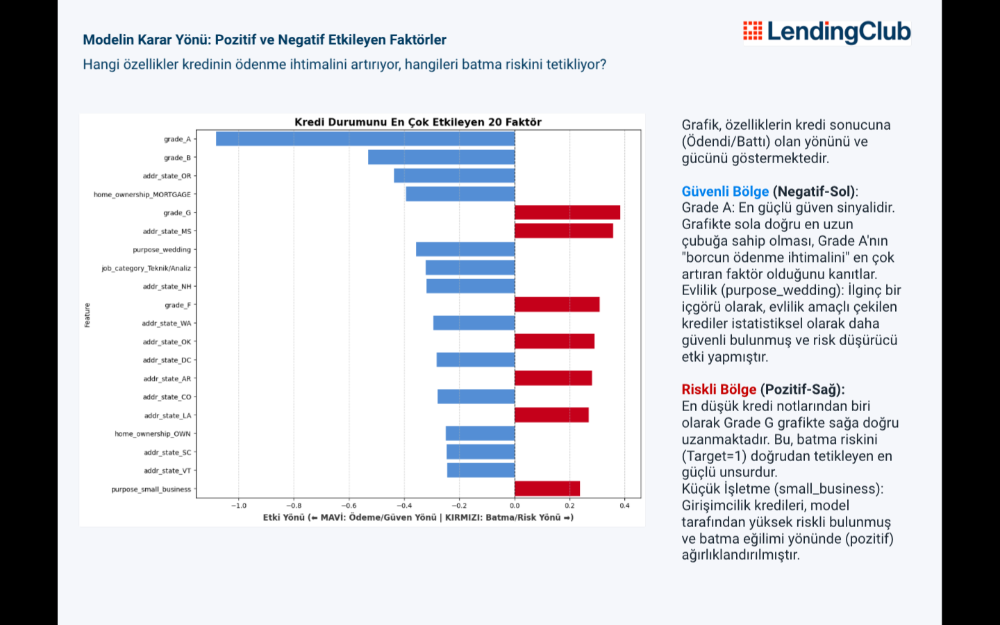
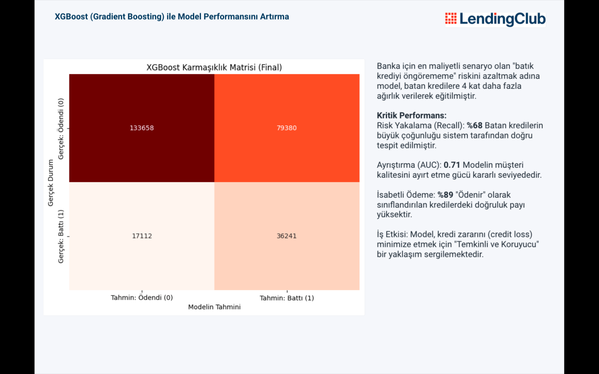
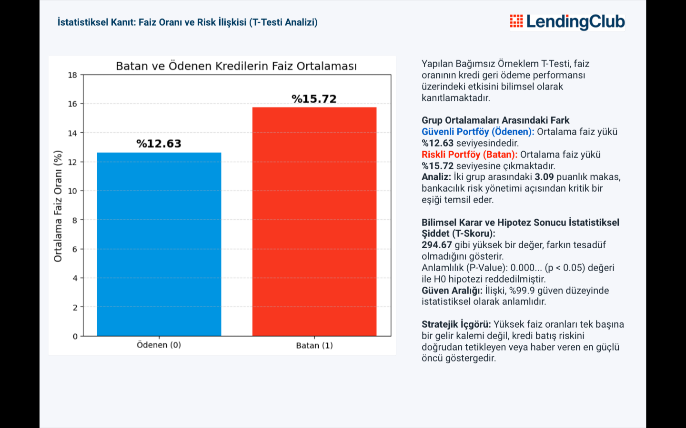
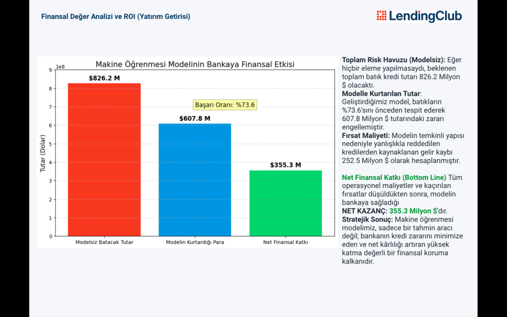
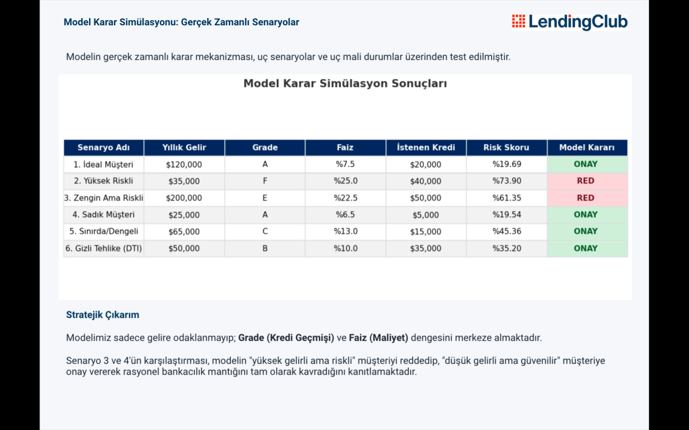

# Lending Club Credit Risk Analysis — End-to-End Decision Support System

This project delivers an end-to-end Machine Learning + Business Intelligence solution for credit risk management using **2.2M Lending Club loan records**. The workflow covers data cleaning, BigQuery modeling, interactive dashboards in Looker Studio, and ML-based risk scoring to support lending decisions.

---

## Business Impact (ROI)

- **Loss Prevention:** Prevented **$607.8M** potential losses from a total risk pool of **$826.2M**
- **Net Financial Contribution:** **$355.3M** net profit after opportunity costs (false rejections)
- **Risk Identification (Recall):** Identified **73.6%** of defaults before issuance

---

## Tech Stack

- **Data Science / ML:** Python (Pandas, NumPy, Scikit-learn, XGBoost), Matplotlib
- **Data Warehousing:** Google BigQuery (SQL)
- **Business Intelligence:** Looker Studio
- **Environment:** Google Colab
## Notebook (Colab / ML)
- [LendingClub_ML.ipynb](notebooks/LendingClub_ML.ipynb)
---

## Project Workflow (End-to-End)

1. **Data Cleaning & Preparation (Colab / Python)**
   - Performed core data cleaning, feature engineering, and EDA
2. **Data Modeling (BigQuery / SQL)**
   - Applied additional cleaning checks, joined tables via **ID-based** keys
   - Built analysis-ready **views** for BI consumption
3. **Dashboarding (Looker Studio)**
   - Connected Looker Studio to BigQuery views
   - Embedded analytical visuals (EDA + model outputs) into reporting pages
4. **Machine Learning (Colab)**
   - Built and evaluated classification models to predict default risk
   - Produced business-oriented interpretation and ROI framing

---

## Analytical Highlights

### 1) Statistical Evidence & EDA
- **Chi-Square Test:** Demonstrated strong dependency between **Loan Grade** and repayment performance (**p-value < 0.001**)
- **T-Test:** Defaulted loans show higher average interest rate (**15.72%**) than paid loans (**12.63%**)
- **Pearson Correlation:** Strong inverse relationship between **FICO** and interest rate (**-0.40**)

### 2) Machine Learning Pipeline
- **Model Choice:** XGBoost (Gradient Boosting) to capture non-linear financial relationships
- **Class Imbalance Handling:** Cost-sensitive learning (higher weight on the “Default” class)
- **Model Interpretability:** Feature importance analysis (e.g., **Grade A** as a dominant signal)

### 3) Real-Time Decision Simulation
Validated rational lending logic via scenario testing:
- A “high income but risky” profile can be rejected,
- While a “lower income but reliable” profile can be approved based on risk score.

---

## Looker Studio Dashboards

Main reporting layers:
- **Customer Portfolio:** Client distribution and key financial indicators
- **Risk Analysis:** Default rate, credit loss, and risk drivers
- **Risk Segmentation:** Risk by occupation and employment length
- **Debt Health:** DTI analysis and impact on default probability

## Looker Studio Dashboard (View-only)
- Dashboard Link: https://lookerstudio.google.com/reporting/3e264e91-b533-4840-a1ef-cc72908f1906

---

## Repository Structure

- `notebooks/` — Colab notebooks (data prep + ML)
- `sql/` — BigQuery SQL scripts / view logic (if included)
- `images/` — Dashboard and model visuals used in README

---

## Key Recommendations

- **Automatic Rejection / Collateral:** Grade **F–G** applications (default rate > 50%) should trigger automatic rejection or additional collateral requirements
- **Dynamic Pricing:** Personalize interest rates based on model risk score to optimize return vs risk

---
## Visual Highlights — Lending Club Credit Risk Project

> The visuals below follow the same order as the Looker Studio dashboard.

---

### 1) Dashboard Overview

---

### 2) Risk Analysis

---

### 3) Risk Segmentation

---

### 4) Debt Health (DTI)

---

### 5) Target Imbalance & Baseline (Logistic Regression)

---

### 6) Feature Impact Direction

---

### 7) XGBoost Confusion Matrix (Final)

---

### 8) T-Test: Interest Rate vs Default

---

### 9) Business Impact / ROI

---

### 10) Real-Time Decision Simulation

## Contributors

- Selen İmahanoğlu
- Tuğçe Belen
- İlayda Gürcan
